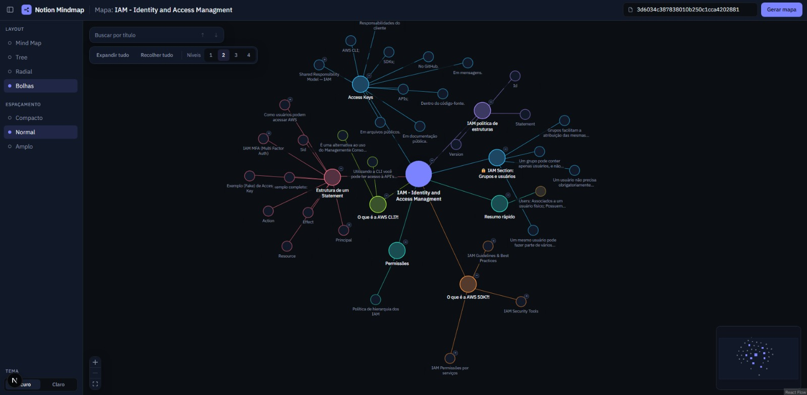
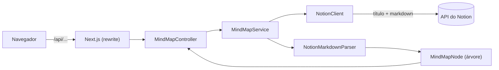

# Notion Mindmap

Cole o ID de uma página do Notion e veja ela virar um mapa mental que dá pra navegar. Comecei pra estudar: minhas anotações de AWS ficam em páginas longas, e um mapa deixa a estrutura visível de uma vez.



**Demo:** (link da demo, depois do deploy). A demo pública roda só com um mapa de exemplo, sem backend. Pra usar com as suas páginas, rode localmente (instruções abaixo).

## O que já faz

- Lê uma página do Notion pela API oficial e converte o conteúdo numa árvore própria: títulos, listas, callouts, colunas, blocos de código e citações.
- Desenha a árvore com React Flow e layout automático (dagre).
- Ramos começam recolhidos, com contador de itens escondidos, cor por ramo, busca por título e painel com o texto completo de cada nó.
- Responde em cerca de 1,8 s numa página longa.

## Como funciona



O frontend só conversa com o meu backend. O backend é o único que conhece o Notion: ele busca o conteúdo, o parser transforma em `MindMapNode` e o front recebe um JSON simples, sem nada do formato do Notion. Se um dia eu aceitar PDF ou markdown local, entra um parser novo que devolve o mesmo `MindMapNode`, e o front nem percebe.

## Decisões que valem explicar

**Árvore própria em vez de repassar o JSON do Notion.** O Notion entrega uma lista reta de blocos. O mapa precisa de pai e filho. O parser usa uma pilha com o caminho de títulos atual: um título novo desempilha os de nível igual ou maior e vira filho do que sobrou. Parágrafos, código e citações viram a descrição do nó, e só títulos, itens de lista e callouts viram caixinhas, senão o mapa fica ilegível.

**Markdown em vez de blocos: de 11,2 s para 1,8 s.** A primeira versão lia os blocos um a um. Os filhos de callouts, colunas e listas aninhadas não vêm junto, então cada um exige uma chamada nova, e o Notion limita a cerca de 3 requisições por segundo. Numa página real minha, deu 11,2 s. O endpoint de markdown devolve a página inteira numa chamada: cerca de 0,5 s no Notion e 1,8 s na resposta completa do backend. O custo foi escrever um parser de markdown com as extensões do Notion (colunas e callouts viram tags) e perder os ids de bloco. O parser de blocos continua no código como plano B.

**Ids derivados do caminho.** Sem os ids de bloco do Notion, o id de cada nó é calculado a partir do caminho dele (pai, tipo, título e ocorrência entre irmãos). O mesmo conteúdo gera os mesmos ids, o que vai permitir preservar cores e posições quando o mapa for atualizado. O limite: renomear um título muda o id dele e o dos filhos.

As outras decisões ficam em [docs/DECISIONS.md](docs/DECISIONS.md).

## Stack

- **Backend:** Java 21, Spring Boot, WebClient/RestClient, Jackson, JUnit
- **Frontend:** Next.js, TypeScript, Tailwind, React Flow, dagre
- **Infra local:** Docker Compose (Postgres)
- **CI:** GitHub Actions (testes do backend, lint e build do front, gitleaks)

## Rodando localmente

Precisa de Java 21, Maven, Node 20 ou mais novo e Docker.

1. Crie um token em [notion.so/profile/integrations](https://www.notion.so/profile/integrations). Numa integração interna, conecte a página pelo menu `...` > Conexões.
2. Defina o token como variável de ambiente (ele nunca vai pro código nem pro front):
    - PowerShell: `$env:NOTION_TOKEN="seu_token"`
    - bash: `export NOTION_TOKEN="seu_token"`
3. Suba o Postgres: `docker compose up -d`. A aplicação sobe junto com ele, mas ainda não grava nada.
4. Backend: `cd backend/mindmap-api` e `mvn spring-boot:run` (porta 8080).
5. Frontend: `cd frontend`, `npm install` e `npm run dev`, depois abra `localhost:3000`.

Pra copiar o ID de uma página, pegue os 32 caracteres no final da URL dela.

Testes: `mvn test` no backend, `npm run lint` e `npm run build` no frontend.

## Estrutura

```
backend/mindmap-api   API em Spring Boot
frontend              Next.js
docs                  decisões e imagens
docker-compose.yml    Postgres local
```

## O que ainda não existe

- Login com Notion (OAuth2). Hoje o backend usa um token meu, então ele só roda na minha máquina.
- Salvar mapas no Postgres (JSONB), junto com cores e posições editadas.
- Exportar PNG e SVG.
- Botão "atualizar mapa" quando a página muda no Notion.
- Camada de IA opcional pra reorganizar o conteúdo.

## Segurança

O conteúdo das páginas é tratado como dado não confiável: o front renderiza tudo como texto, sem HTML cru. O token do Notion fica só no backend, em variável de ambiente. O ID da página é validado no front e de novo no backend. O CI roda o gitleaks no histórico inteiro do repositório.
